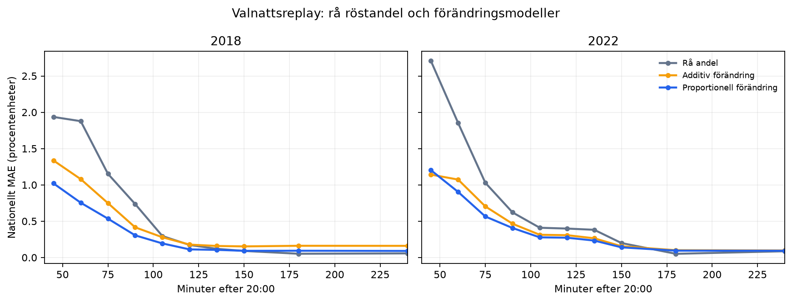

# Backtest av valnattsprognos

## Slutsats

**Ja, förändringsidén hjälper tydligt under den tidiga valkvällen.** Den
proportionella varianten minskar det tidsintegrerade nationella felet mellan
21:00 och 23:00 med 48,4
procent 2018 och 39,0
procent 2022 jämfört med den råa röstandelen bland rapporterade distrikt.

Den förregistrerade primärmodellen var additiv förändring. Den förbättrar också
det samlade felet i båda valen, men vinner bara 11 av 16 kontrollpunkter och
missar därför den låsta 75-procentsgaten. Den sekundära proportionella modellen
var registrerad före körningen och klarar samma numeriska krav: 13 av 16
kontrollpunkter samt lägre tidsintegrerat fel i båda valen.

Signalen är starkast när få distrikt har rapporterat. När omkring två
tredjedelar eller mer av rösterna är räknade blir den råa röstandelen normalt
bättre. En praktisk liveprodukt bör därför gradvis lämna över från modellen
till det observerade resultatet.

## Design

Designen låstes i git före första score (`416af9f`, med en ren YAML-fix i
`b72f89c`).

- Valmyndighetens faktiska rapporteringstider och preliminära distriktsröster.
- 6 004 fysiska valdistrikt 2018 och 6 264 år 2022.
- Förändringen beräknas bara i officiellt jämförbara distrikt: 4 631 respektive
  4 164.
- Råresultatet använder samtliga rapporterade fysiska distrikt.
- Målet är det slutliga nationella resultatet i nio kategorier: åtta
  riksdagspartier plus övriga.
- Inga slutresultat från ännu orapporterade distrikt används av modellen.
- Ingen data från valet 2026, VALU eller exit polls används.

## Resultat vid centrala tidpunkter

MAE i procentenheter över de nio partikategorierna.

| Val | Tid | Rapporterade röster | Rå andel | Additiv förändring | Proportionell förändring |
|---:|:---:|---:|---:|---:|---:|
| 2018 | 21:00 | 0,7 % | 1,877 | 1,079 | 0,754 |
| 2018 | 21:30 | 10,3 % | 0,736 | 0,416 | 0,305 |
| 2018 | 22:00 | 43,0 % | 0,173 | 0,178 | 0,112 |
| 2018 | 22:30 | 72,3 % | 0,091 | 0,153 | 0,092 |
| 2018 | 23:00 | 87,7 % | 0,052 | 0,162 | 0,093 |
| 2022 | 21:00 | 0,4 % | 1,853 | 1,073 | 0,903 |
| 2022 | 21:30 | 9,3 % | 0,621 | 0,464 | 0,406 |
| 2022 | 22:00 | 19,8 % | 0,399 | 0,307 | 0,273 |
| 2022 | 22:30 | 38,0 % | 0,199 | 0,155 | 0,140 |
| 2022 | 23:00 | 66,8 % | 0,051 | 0,100 | 0,094 |

## Samlat 21:00–23:00

Positiv förbättring betyder lägre tidsintegrerat MAE än den råa röstandelen.

| Val | Additiv ΔAUC | Vinster | Proportionell ΔAUC | Vinster |
|---:|---:|---:|---:|---:|
| 2018 | 24,8 % | 4/8 | 48,4 % | 6/8 |
| 2022 | 29,0 % | 7/8 | 39,0 % | 7/8 |

Den additiva primärgatens samlade vinstfrekvens är
68,8 procent och gaten är därför
**FAIL**. Den registrerade sekundäranalysen når
81,2 procent och skulle under
samma kriterier vara **PASS**. Den distinktionen bevaras för att inte byta
primärmodell efter att resultatet blivit känt.

## Tolkning

Råresultatet är skevt tidigt eftersom små och politiskt annorlunda distrikt
rapporterar först. När samma rapporterade distrikt jämförs med sitt föregående
resultat försvinner mycket av den nivåskillnaden. Proportionella förändringar
fungerar bättre än rena procentenhetsförändringar i båda valen.

Detta är en valnattsmodell, inte en förbättring av den frysta förvalsprognosen.
Nästa version bör använda förvalsprognosen som prior, uppdatera den med
proportionell förändring och vikta över mot råresultatet när täckningen ökar.
Övergångsregeln måste låsas och testas på fler val innan den används live.

## Begränsningar

Arkiven lagrar den senaste preliminära rapporten per distrikt. För två distrikt
i varje val har en senare rättelse sannolikt ersatt den ursprungliga
tidsstämpeln. De ligger efter 02:00 och påverkar inte huvudfönstret 21:00–23:00.

Backtestet omfattar bara två val. Telefonstoppet 2022 finns korrekt kvar i
replayen och är en styrka, men två val räcker inte för att optimera en
överlämningspunkt utan påtaglig risk för överanpassning.
