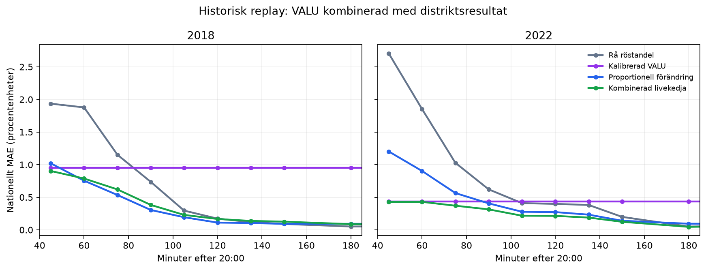

# VALU-backtest och liveberedskap

## Slutsats

Den historiska, tidskorrekta VALU-korrigeringen klarar den förregistrerade
gaten. Den minskar genomsnittligt MAE från 0,729
till 0,696 procentenheter, en förbättring
på 4,5 procent, och förbättrar samtliga
tre framåtriktade testval.

Effekten är liten och materialet omfattar bara fyra VALU-prognoser. Korrigeringen
ska därför ses som försiktig biasjustering, inte som ett facit.

Den i förväg låsta livekedjan – kalibrerad VALU, proportionell förändring i
rapporterade jämförbara distrikt och slutligen råresultat – förbättrar
tidsintegrerat fel mot båda sina baslinjer i replay av både 2018 och 2022.



## Historiska 20:00-prognoser

Underlaget är SVT:s viktade prognos som presenterades när vallokalerna stängde,
inte senare VALU-tabeller som viktats mot ett känt preliminärt eller slutligt
valresultat.

| Testval | Rå VALU MAE | Tidskorrekt korrigerad MAE | Förbättring |
|---:|---:|---:|---:|
| 2014 | 0,774 | 0,697 | 9,9 % |
| 2018 | 0,958 | 0,952 | 0,6 % |
| 2022 | 0,455 | 0,438 | 3,8 % |

Kalibreringen är expanding-window:

- 2014 använder endast felet 2010,
- 2018 använder endast 2010 och 2014,
- 2022 använder endast 2010, 2014 och 2018.

Ingen information från testvalets slutresultat används för att korrigera samma
val. En separat leave-one-election-out-tabell finns i `fold_metrics.csv`.

## Låst korrigering för VALU 2026

Värdena nedan är skattat historiskt `VALU − slutresultat`, krympt mot noll med
två val som priorstyrka. Vid publicering subtraheras värdet från rå VALU och
vektorn projiceras tillbaka till summan 100 procent.

| Parti | Skattat fel, procentenheter |
|:---|---:|
| V | +0,438 |
| S | -0,610 |
| MP | +0,396 |
| C | +0,368 |
| L | +0,138 |
| M | -0,737 |
| KD | +0,245 |
| SD | -0,304 |
| OTHER | +0,067 |

Den skattade felkovariansen och alla lås finns i `estimator_lock.json`.
Osäkerheten bygger på endast fyra val och ska beskrivas som approximativ.

## Kombination med valnattsräkningen

Den förregistrerade vikten använder andelen rapporterade distrikt, vilket är
känt i realtid:

1. vid noll rapporterade distrikt är prognosen kalibrerad VALU,
2. proportionell förändring tar snabbt över när jämförbara distrikt rapporterar,
3. råresultatet tar gradvis över när distriktstäckningen blir hög.

| Replay | Förbättring mot rå räkning | Förbättring mot konstant VALU |
|---:|---:|---:|
| 2018 | 44,6 % | 64,4 % |
| 2022 | 65,9 % | 44,7 % |

Gaten kräver lägre tidsintegrerat fel än båda baslinjerna i båda valen:
**PASS**.

## Väljarflöden

Historiska flödestabeller används inte i backtestet. De offentliga tabeller som
överlevt från 2014, 2018 och 2022 har viktats eller reviderats efter att
preliminära eller slutliga resultat blivit kända.

Om en fullständig 2026-matris publiceras kan den användas för geografisk
fördelning. Då är matrisen kernelstruktur och VALU-topplinjen används exakt en
gång som rakingmål. De får inte behandlas som två oberoende mätningar.

## Körning på valkvällen

1. Spara den publicerade originalkällan och beräkna SHA-256.
2. Kopiera `data/templates/valu_2026.template.json`.
3. Sätt `status` till `published`, fyll tidsstämplar, källa, stickprovsstorlek
   och andelar som bråk mellan 0 och 1.
4. Lägg eventuellt in en fullständig 9×9-flödesmatris.
5. Kör:

```bash
uv run valforecast prepare-valu-live --input <fil.json>
uv run valforecast prepare-valu-live --input <fil.json> --write
```

Utan `--write` valideras och visas resultatet. Med `--write` skapas
`reports/live/valu_2026.json`. Kommandot kan aldrig skriva över den frysta
förvalsprognosen.

## Status före klockan 20

2026-mallen är `pending`. Pipen returnerar därför endast
`waiting_for_published_valu`; ingen syntetisk VALU eller valresultat används.
